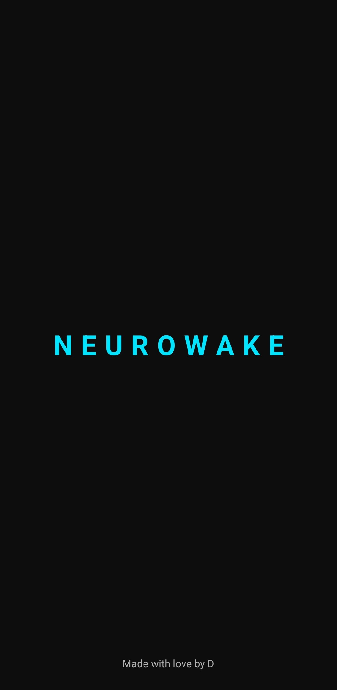
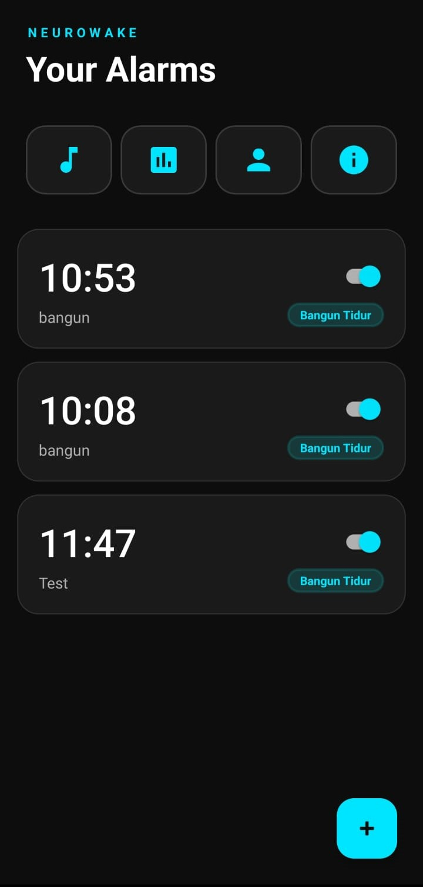
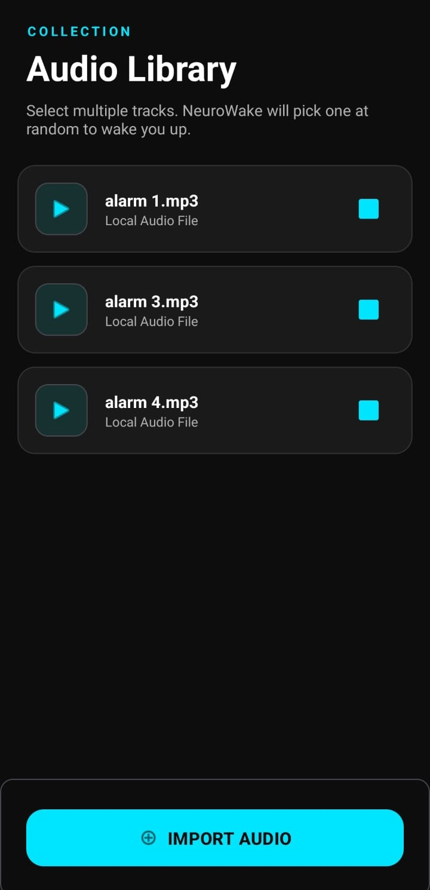

# 🧠 NeuroWake v1.1

**NeuroWake** adalah aplikasi alarm Android cerdas yang dirancang untuk memastikan Anda benar-benar bangun dengan kondisi otak yang aktif. Menggunakan konsep "Neuro-Logic", aplikasi ini memaksa Anda menyelesaikan tantangan matematika sebelum alarm dapat dimatikan.

---

## 🚀 Fitur Unggulan (Update v1.1)

*   **⚡ Neuro-Logic Challenge**: Pilih tingkat kesulitan (Mudah/Sulit) untuk tantangan matematika yang harus diselesaikan agar alarm berhenti. 
*   **⏭️ Proactive Smart Skip**: Anda bisa melewati alarm hanya untuk hari ini (otomatis aktif lagi besok) jika Anda terbangun lebih awal.
*   **🎵 Smart Audio Library**: Impor file audio lokal Anda sendiri. Aplikasi akan mengacak lagu yang Anda pilih setiap kali alarm berbunyi.
*   **📊 Statistik Disiplin**: Pantau kedisiplinan Anda dengan sistem peringkat meme yang unik.
*   **👤 Profil Personal**: Kustomisasi profil dengan nama, foto, dan badge dinamis yang menunjukkan level kedisiplinan Anda.

> 💡 **Fakta Ilmiah**: Penelitian menunjukkan bahwa menggunakan satu nada alarm yang sama secara terus-menerus dapat menyebabkan *Habituation*, di mana otak mulai menganggap suara tersebut sebagai "suara latar" yang tidak berbahaya sehingga Anda tetap tertidur. **NeuroWake** mengatasi hal ini dengan fitur **Smart Audio Shuffle**—mengacak koleksi lagu pilihan Anda untuk memberikan rangsangan sensorik yang berbeda setiap pagi, memastikan Anda bangun dengan lebih efektif!

---

## 📸 Tampilan Aplikasi

  
  
  

---

## 📥 Cara Download & Instalasi

Untuk mencoba aplikasi ini di perangkat Android Anda, ikuti langkah berikut:

1.  Buka halaman **[Releases](https://github.com/ammangdzaky/neurowake-app/releases/)** di repositori ini.
2.  Download file **`NeuroWake-v1.1.apk`**.
3.  Buka file APK tersebut di HP Anda.
4.  Jika muncul peringatan keamanan, aktifkan izin **"Install from Unknown Sources"** di pengaturan HP Anda.
5.  Selesaikan instalasi dan buka aplikasi.

---

## 🛠️ Teknologi yang Digunakan

*   **Language**: Java
*   **UI Framework**: Material Design 3 (Google)
*   **Storage**: Internal Storage (File I/O) & SharedPreferences
*   **Android API**: AlarmManager, NotificationManager, Foreground Service, KeyguardManager, System Alert Window.

---

## 👨‍💻 Pengembang

**Abdurrahman Dzaky Safrullah**
*   GitHub: [@ammangdzaky](https://github.com/ammangdzaky)
*   Source Code: [neurowake-app](https://github.com/ammangdzaky/neurowake-app)

---

## 📜 Lisensi

Proyek ini dibuat untuk tujuan pembelajaran. Silakan digunakan dan dikembangkan lebih lanjut!
